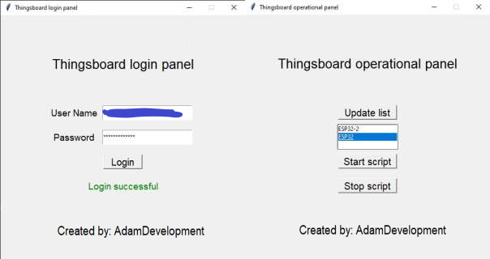

# Thingsboard and Hass Integration

## ***License***

This project is licensed under the MIT License - see the [LICENSE](LICENSE) file for details.

## ***Introduction***

Hello everyone! This is my first ever <strong>big</strong> project published on github related to my Engineering Thesis. The topic was <strong><em>"Acquisition and monitoring of vital functions of the occupants in the building"</em></strong>. Feel free to explore the code, experiment with it, and provide any feedback or suggestions you might have. I'm open to collaborations and would appreciate any contributions or ideas that could help improve the project. Thank you for checking out my work, and I hope it can be useful or inspiring to you in some way!

## ***Table of contents***

1. [Overview](#1-overview)
2. [Structure](#2-structure)
3. [Prerequisites](#3-prerequisites)
   - [Used software](#used-software)
   - [Used hardware](#used-hardware)
   
4. [Getting started](#4-getting-started)
5. [Thingsboard](#5-thingsboard)
6. [Home Assistant](#6-home-assistant)
7. [Known/Discovered issues](#7-knowndiscovered-issues)
8. [Contributing](#8-contributing)
## ***1. Overview***

  
The main goal of the project was to prepare a system that allows an acquisition and monitoring of vital functions (oxygen saturation, heart rate, temperature and ECG) in a smart building using a dedicated device. The element responsible for collecting this data was FireBeetle ESP32-E Iot, while Raspberry Pi 4B was used as an main server. 
To visualise the collected vital parameters, The thingsboard platform was used as administrative panel for the entire soulution, to which the managing person had remote access, ensuring high system availability and immediate response in case of malfunction. The end system, available to user was Home Assistant, to which data was transmitted using the REST API of the main server.  
Achieving the flexibility of the solution and its scalabilty was guaranteed by the use of Docker platform, in which previously mentioned buliding automation system was containerized.  
To secure client – server communication and data transmission via the MQTT protocol, certificates with self – signature were used, ensuring appropriate security of transport layers through SSL/TLS cryptographic protocols.

  

  

## ***2. Structure***

- `include/`: Contains header files with declarations and macro definitions used across the project
- `python/`: Contains necessary files to authorize user and send collected telemetry data from Thingsboard's database
- `src/`: Contains main C++ files for telemetry aquisition

## ***3. Prerequisites***
> [!NOTE]
>  - Elements listed below are just my subjective choices, which let me to create this project, hence, allowed smooth and effective workflow within my workspace, be free to pick anything that suits you
>  - Learned the hard way, it's better to take a shot with Hass that supports HACS (Home Assistant Community Store).

#### Used software:

- Visual Studio Code;
- PlatformIO extension;
- Docker Desktop - for Home Assistant container;
- Thingsboard Community Edition;
- Home Assistant (Core);
- WSL2 - To facilitate server management and support container handling;
- VNC Viewer - For RPi initial configuration and other tasks that require a visual image;
- Nginx - To ensure user access to Thingsboard panel from anywhere;
- Certbot & OpenSSL - For self - signed certificates (MQTT and server-web browser encryption).

#### Used hardware:
- Raspberry Pi 4B 8GB - Main server for Thingsboard and telemetry
- FireBeetle 2 ESP32-E IoT 4MB - Microcontroller used to collect data from sensors;;
- MAX30102 - pulse and saturation sensor;
- AD8232 - ECG sensor;
- SHT35 - temperature sensor

## ***4. Getting Started***

1. Clone the repository - https://github.com/AdamDevelopment/Thingsboard-and-Hass-Integration.git
2. Follow the setup instructions for PlatformIO
3. Download necessary libraries:
    - Wire

    - knolleary/PubSubClient@^2.8

    - https://github.com/Risele/SHT3x.git

    - sparkfun/SparkFun MAX3010x Pulse and Proximity Sensor Library@^1.1.2

    - https://github.com/tzapu/WiFiManager

    - https://github.com/bblanchon/ArduinoJson

4. Configure `platformio.ini`

## ***5. Thingsboard***

In the project, ThingsBoard was utilized to visualize data from sensors (temperature, pulse, oxygen saturation, ECG), enabling remote system management and monitoring. Installed on a Raspberry Pi 4B, ThingsBoard offered real-time dynamic data visualization using various widgets. 

#### **Installation and Setup**:

ThingsBoard was installed on a Raspberry Pi, using `OpenJDK` and `PostgreSQL`. It was made accessible by setting up Nginx for proper port-forwarding and by employing a free DNS service from https://www.duckdns.org/, which allowed the end user to access it from anywhere in the world.

#### **Communication Security**:

Communication between the server and devices was secured using the MQTT protocol with TLS encryption, involving SSL/TLS certificates. Self-signed certificates, produced by `OpenSSL` and managed by `Let's Encrypt` and `Certbot`, heightened the security of the data being exchanged between devices and the server. This setup ensured lightweight communication between ThingsBoard's server-side and ESP32. More details available at https://mqtt.org/.

#### **Remote Access and Security**: 

Nginx was configured to act as a reverse proxy that redirected traffic from HTTP to HTTPS, thereby securing the connection. Additionally, dynamic DNS was implemented using DuckDNS, enhancing easy remote server access. It was possible to connect to local network via VPN, by using `OpenVPN` and proper configuration file.

## ***6. Home Assistant***

To ensure accurate and continuous visualization of ECG data on a chart, significant customizations were necessary due to the specific demands of real-time, high-frequency data sampling. The configuration was designed to handle data transmitted via the `REST API`, with adjustments made to the graph span and offset. This was done to account for any inherent delays in data transmission, setting the graph span to 10 seconds and applying an 8-second backward offset, which helped maintain a seamless and synchronous display of ECG peaks, enhancing the clarity and readability of the data.

The `data_generator` function was critical in this process. It maps the 'data' attribute from the ECG sensor—comprising timestamps and their corresponding values—into pairs. These pairs are then formatted to suit the visualization component, ensuring that the ECG data is represented clearly and effectively.

To address the limitations of Home Assistant in processing high-frequency real-time data, which is collected and sent every 12-15 ms, custom templates were employed within the `configuration.yaml` file. These templates support the integration with a graph card powered by `ApexCharts.js` (https://github.com/RomRider/apexcharts-card). This setup is doing good at managing historical data, effectively processing 500 to 600 samples collected over a few seconds, thus enabling comprehensive ECG data visualization on the Lovelace UI in Home Assistant.

  

## ***7. Known/Discovered issues***

1. Physically swapped diodes in MAX30102 (red and infrared). Software swap helped - https://github.com/aromring/MAX30102_by_RF/issues/13 and https://github.com/sparkfun/SparkFun_MAX3010x_Sensor_Library/issues/25
2. Due to low amount of Flash memory, I wasn't able to do OTA software updates (Over-The-Air)
3. Sleep modes are possible https://docs.espressif.com/projects/espidf/en/stable/esp32/api-reference/system/sleep_modes.html and working (kinda), but I couldn't make it work with my solution. Multi-threading and LightSleep are not good friends
4. The amount of collected data made my server unsuable due to little to no free memory. I had to change `sql.ttl.ts.ts_key_value_ttl` parameter in Thingsboard's config to 7 days (in seconds) and manually delete records
5. I needed to implement a `for` loop to correctly assign timestamps when sending data to Home Assistant. Without these timestamps, Thingsboard defaults to using the server's time for telemetry data. However, when transmitting JSON with specific headers (i.e ECG), Home Assistant had trouble interpreting this data due to missing or incorrect timestamps, resulting in errors displaying this data on widgets
6. Poor quality of photos, sorry

## ***8. Contributing***

Contributions are welcome! Please feel free to submit pull requests or open issues to suggest improvements or report bugs.
